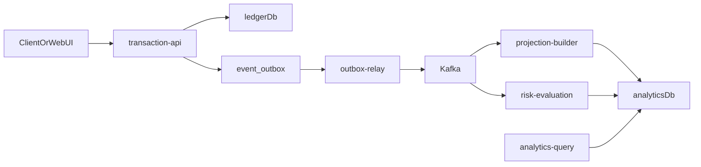

# Микросервисная система потоковой обработки финансовых транзакций

Учебный проект для темы:

`проектирование и разработка микросервисной системы потоковой обработки финансовых транзакций`

Система строится вокруг write-side API, transactional outbox, Kafka и независимых read-side subscribers. Цель проекта не в количестве контейнеров, а в понятных service boundaries, CQRS-подобном разделении контуров и production-like event-driven flow.

## Что реализовано

- `transaction-api` принимает write-запросы, валидирует их, пишет транзакции в `ledger` DB, ведет audit log и сохраняет integration events в `event_outbox`.
- `outbox-relay` публикует события из transactional outbox в Kafka.
- `projection-builder` независимо читает `transactions.events`, строит read-model `analytics_transactions` и потоковую projection-таблицу `transaction_event_stats`.
- `risk-evaluation` независимо читает тот же поток и фиксирует risk / monitoring events в `monitoring_events`.
- `analytics-query` читает только `analytics` DB и не обращается к write-side таблице `transactions`.
- `dlqreplay` служит ops-инструментом для повторной публикации payload из DLQ в основной topic.
- `Prometheus`, `Grafana` и `kafka-exporter` показывают health, metrics и lag consumer groups.

## Архитектура

### Runtime topology

- `transaction-api` - write-side owner транзакций и outbox intent.
- `outbox-relay` - технический publisher из `event_outbox` в Kafka.
- `projection-builder` - read-model builder для analytics-side.
- `risk-evaluation` - независимый subscriber для правил мониторинга.
- `analytics-query` - query-side HTTP service.
- `postgres` - один PostgreSQL instance с двумя logical databases:
  - `salestracker_ledger`
  - `salestracker_analytics`
- `kafka` - event backbone.

### Event flow



### Почему это уже похоже на microservice architecture

- write-side и read-side разделены на уровне ownership и доступа к данным;
- integration event contract отделен от внутренних persistence-моделей;
- read-side split на два независимых subscribers, а не на один «комбайн»;
- дедупликация стала `subscriber-aware`: одно и то же событие может быть обработано разными сервисами независимо;
- query-сервис больше не зависит от write-side таблиц.

## Структура проекта

- `cmd/server` - `transaction-api`
- `cmd/analytics` - `analytics-query`
- `cmd/relay` - `outbox-relay`
- `cmd/projectionbuilder` - `projection-builder`
- `cmd/riskevaluation` - `risk-evaluation`
- `cmd/dlqreplay` - replay из DLQ
- `cmd/load` - генератор demo-нагрузки
- `internal/services/transactionapi` - service-owned write-side slice
- `internal/services/analytics` - service-owned query-side slice
- `internal/services/outboxrelay` - runtime `outbox-relay`
- `internal/services/projectionbuilder` - runtime `projection-builder`
- `internal/services/riskevaluation` - runtime `risk-evaluation`
- `internal/services/processing/store` - PostgreSQL adapters для analytics-side projections
- `internal/services/processing/subscriber` - общий runtime loop для Kafka subscribers
- `internal/services/transactionapi/integrationevents` - event builder между write model и wire contract
- `internal/shared/contracts/transactionevents` - стабильный integration contract событий
- `migrations/ledger` - write-side schema
- `migrations/analytics` - read-side schema

Legacy-пакеты `internal/bootstrap`, `internal/handlers`, `internal/service` и устаревшие root migrations удалены, чтобы репозиторий отражал только живую архитектуру.

## Сервисы и endpoints

### `transaction-api`

- `GET /`
- `GET /health`
- `GET /ready`
- `GET /metrics`
- `POST /items`
- `GET /items`
- `GET /items/{id}`
- `PUT /items/{id}`
- `DELETE /items/{id}`

### `analytics-query`

- `GET /health`
- `GET /ready`
- `GET /metrics`
- `GET /analytics`
- `GET /analytics/stream`

### Subscriber services

- `projection-builder`
  - `GET /health`
  - `GET /ready`
  - `GET /metrics`
- `risk-evaluation`
  - `GET /health`
  - `GET /ready`
  - `GET /metrics`
- `outbox-relay`
  - `GET /health`
  - `GET /ready`
  - `GET /metrics`

### Demo auth

Пользовательские маршруты требуют:

```http
Authorization: Bearer dev-token
```

В demo-конфигурации токен привязан к пользователю `11111111-1111-1111-1111-111111111111`.

## Kafka contract

Все lifecycle events транзакций используют один JSON envelope:

```json
{
  "event_id": "uuid",
  "event_type": "transaction.created",
  "event_time": "2026-03-21T16:00:00Z",
  "correlation_id": "uuid",
  "schema_version": 1,
  "source": "diploma-app",
  "aggregate_id": "transaction-uuid",
  "transaction": {
    "id": "uuid",
    "user_id": "uuid",
    "amount": "1500.00",
    "currency": "RUB",
    "from_account_id": "uuid",
    "to_account_id": null,
    "provider_id": "uuid",
    "category_id": "uuid",
    "type": "expense",
    "status": "done",
    "description": "Lunch",
    "external_id": "ext-123",
    "occurred_at": "2026-03-21T16:00:00Z",
    "created_at": "2026-03-21T16:00:01Z",
    "updated_at": "2026-03-21T16:00:01Z",
    "deleted_at": null
  }
}
```

Для `transaction.updated` и `transaction.status_changed` дополнительно передаются `before` и `after`. Для `transaction.status_changed` также передаются `old_status` и `new_status`.

Контракт хранится в `internal/shared/contracts/transactionevents` и теперь не зависит от `internal/models`.

## Данные и ownership

### `ledger` DB

Используется только write-side сервисами:

- `transaction-api`
- `outbox-relay`

Основные таблицы:

- `transactions`
- `idempotency_keys`
- `audit_logs`
- `event_outbox`

### `analytics` DB

Используется только read-side и async subscribers:

- `analytics-query`
- `projection-builder`
- `risk-evaluation`

Основные таблицы:

- `analytics_transactions`
- `transaction_event_stats`
- `monitoring_events`
- `processed_events`

Таблица `processed_events` хранит дедупликацию в виде `(subscriber_name, event_id)`, поэтому `projection-builder` и `risk-evaluation` могут независимо обрабатывать один и тот же event.

## Конфигурация

Базовые defaults лежат в `config.yaml`, локальные переопределения - в `environment/.env`.

Ключевые переменные:

- `LEDGER_DB_*`
- `ANALYTICS_DB_*`
- `KAFKA_BROKERS`
- `KAFKA_TOPIC`
- `KAFKA_DLQ_TOPIC`
- `KAFKA_CONSUMER_GROUP_ID`
- `CONSUMER_METRICS_PORT`
- `MONITORING_LARGE_AMOUNT_THRESHOLD`
- `SECURITY_AUTH_TOKENS`

Для обратной совместимости код по-прежнему понимает `POSTGRES_*` как fallback для ledger-side, но рекомендуемый способ настройки - через `LEDGER_DB_*` и `ANALYTICS_DB_*`.

## Запуск

### Полный demo-стек

```bash
make compose-up
```

Поднимаются:

- `postgres`
- `kafka`
- `kafka-init`
- `transaction-api`
- `analytics-query`
- `outbox-relay`
- `projection-builder`
- `risk-evaluation`
- `prometheus`
- `grafana`
- `kafka-exporter`

### Только core stack без observability

```bash
make compose-up-core
```

### Сброс и чистый старт

```bash
make compose-down-v
make compose-up
```

### Локальный запуск отдельных процессов

```bash
make run
make run-analytics
make run-relay
make run-projectionbuilder
make run-riskevaluation
```

Если стек уже поднят через Compose, локально запускать эти же сервисы обычно не нужно: порты уже заняты контейнерами.

## Полезные команды Makefile

- `make compose-config` - провалидировать topology
- `make compose-up-core` - поднять core stack
- `make compose-up` - поднять полный demo stack с observability profile
- `make compose-stop` - остановить контейнеры
- `make compose-down-v` - остановить контейнеры и удалить volumes
- `make compose-logs SERVICE=projection-builder` - посмотреть логи сервиса
- `make verify` - `go test ./...` + сборка ключевых бинарников + `docker compose config`
- `make load-demo`
- `make load-stress`
- `make load-events`
- `make load-errors`
- `make dlq-replay ARGS='-limit 5'`

## Адреса после старта

- Web UI / API: `http://localhost:8081`
- Analytics query: `http://localhost:8082`
- Outbox relay: `http://localhost:8083`
- Projection builder metrics / health: `http://localhost:2112`
- Risk evaluation metrics / health: `http://localhost:2113`
- Prometheus: `http://localhost:9090`
- Grafana: `http://localhost:3000`
- Kafka exporter: `http://localhost:9308/metrics`
- Kafka с хоста: `localhost:9094`
- PostgreSQL с хоста: `localhost:28436`

## Примеры запросов

### Health

```bash
curl -s http://localhost:8081/health
curl -s http://localhost:8082/ready
curl -s http://localhost:8083/ready
curl -s http://localhost:2112/ready
curl -s http://localhost:2113/ready
```

### Создание транзакции

```bash
curl -X POST http://localhost:8081/items \
  -H "Content-Type: application/json" \
  -H "Authorization: Bearer dev-token" \
  -d '{
    "user_id": "11111111-1111-1111-1111-111111111111",
    "amount": "199.99",
    "currency": "RUB",
    "from_account_id": "aaaaaaaa-aaaa-aaaa-aaaa-aaaaaaaaaaaa",
    "provider_id": "77777777-7777-7777-7777-777777777777",
    "category_id": "44444444-4444-4444-4444-444444444444",
    "type": "expense",
    "status": "done",
    "description": "Manual test",
    "external_id": "manual-test-1",
    "occurred_at": "2026-03-21T16:00:00Z"
  }'
```

### Идемпотентное создание

```bash
curl -X POST http://localhost:8081/items \
  -H "Content-Type: application/json" \
  -H "Authorization: Bearer dev-token" \
  -H "Idempotency-Key: my-test-key-1" \
  -d '{
    "user_id": "11111111-1111-1111-1111-111111111111",
    "amount": "350.00",
    "currency": "RUB",
    "from_account_id": "aaaaaaaa-aaaa-aaaa-aaaa-aaaaaaaaaaaa",
    "provider_id": "77777777-7777-7777-7777-777777777777",
    "category_id": "44444444-4444-4444-4444-444444444444",
    "type": "expense",
    "status": "done",
    "description": "Idempotent request",
    "external_id": "manual-test-2",
    "occurred_at": "2026-03-21T16:10:00Z"
  }'
```

### Analytics query

```bash
curl -H "Authorization: Bearer dev-token" \
  "http://localhost:8082/analytics?user_id=11111111-1111-1111-1111-111111111111&from=2026-03-01T00:00:00Z&to=2026-03-31T23:59:59Z"
```

## Тестовые данные

Сиды лежат в `migrations/ledger/002_init_data.sql`.

Удобные demo-значения:

- `user_id`: `11111111-1111-1111-1111-111111111111`
- `from_account_id`: `aaaaaaaa-aaaa-aaaa-aaaa-aaaaaaaaaaaa`
- `category_id`: `44444444-4444-4444-4444-444444444444`
- `provider_id`: `77777777-7777-7777-7777-777777777777`

## Наблюдаемость

Prometheus скрейпит:

- `transaction-api:8080/metrics`
- `analytics-query:8082/metrics`
- `outbox-relay:8083/metrics`
- `projection-builder:2112/metrics`
- `risk-evaluation:2113/metrics`
- `kafka-exporter:9308`

Основные группы метрик:

- HTTP metrics для API и query-side;
- outbox relay throughput / errors;
- Kafka consumer processed / invalid / duplicate / retry / DLQ;
- processing lag;
- projection applied metrics;
- lag consumer groups через `kafka-exporter`.

## Минимальный e2e smoke scenario

1. Поднять стек `make compose-up`.
2. Проверить `health` / `ready` для `transaction-api`, `analytics-query`, `outbox-relay`, `projection-builder`, `risk-evaluation`.
3. Создать транзакцию через `POST /items`.
4. Проверить:
   - запись в `salestracker_ledger.transactions`;
   - запись в `event_outbox`;
   - появление записи в `salestracker_analytics.analytics_transactions`;
   - появление записи в `monitoring_events` для крупной операции;
   - две записи в `processed_events` для одного `event_id`: `projection-builder` и `risk-evaluation`;
   - доступность результата через `analytics-query`.

## Replay и DLQ

`dlqreplay` читает сообщения из `transactions.events.dlq` и публикует исходный payload обратно в основной topic.

Важно: replay не удаляет записи из `processed_events`. Если нужно реально переиграть то же событие, надо удалить запись конкретного subscriber-а вручную.

## Ограничения текущей реализации

- PostgreSQL пока общий на уровне instance, хотя ownership уже разделен по logical databases.
- Kafka учебный: один broker, без replication и security hardening.
- Аутентификация demo-уровня, без отдельного IAM/Auth service.
- Risk evaluation пока ограничен rule-based large amount detection, без полноценного fraud engine.
- Grafana использует явные demo credentials `admin/admin`.

## Что лучше показывать на защите

1. `docker compose ps` с пятью runtime-сервисами: `transaction-api`, `analytics-query`, `outbox-relay`, `projection-builder`, `risk-evaluation`.
2. Диаграмму event flow через outbox и Kafka.
3. Создание транзакции и независимую обработку одним событием двумя subscribers.
4. Отдельное подтверждение read-model (`analytics_transactions`) и risk-layer (`monitoring_events`).
5. Grafana / Prometheus targets и consumer-group lag.

## Что можно развивать дальше

- вынести `ledger` и `analytics` в отдельные физические PostgreSQL instances;
- добавить notification subscriber поверх risk / monitoring events;
- добавить schema registry и более строгую эволюцию event contract;
- добавить OpenTelemetry и distributed tracing;
- усилить auth / IAM / secrets management.
