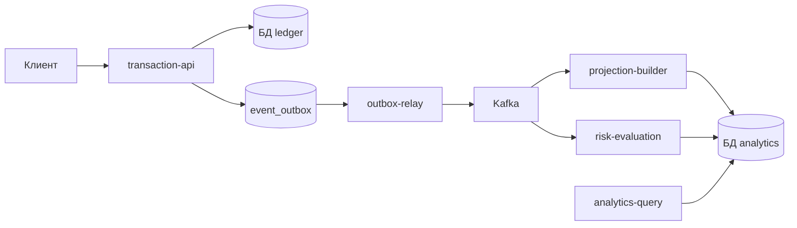

# Микросервисная система потоковой обработки финансовых транзакций

Учебный дипломный проект: **проектирование и разработка микросервисной системы потоковой обработки финансовых транзакций**.

Это не «много контейнеров ради контейнеров», а разделение на отдельные сервисы с понятными зонами ответственности: приём транзакций, асинхронная доставка событий, построение аналитики, оценка рисков, чтение результатов.

Подробный сценарий защиты — в [docs/microservice-defense.md](docs/microservice-defense.md).

---

## Как говорить на защите (коротко)

**Формулировка:** учебная **микросервисно-ориентированная событийная система** с разделением контуров записи, асинхронной обработки и чтения.

**Не утверждать:** «production-банк», «полный антифрод», «соответствие PCI».

**Утверждать честно:**
- отдельные процессы под запись, ретрансляцию событий, проекции, риски и запросы;
- транзакционный outbox — событие не теряется между БД и Kafka;
- два независимых подписчика на один поток (аналитика и риски);
- две базы: операционная (ledger) и аналитическая (analytics);
- наблюдаемость: метрики, журналы, алерты по правилам.

---

## Схема потока (для слайда)



**Смысл для речи:** HTTP нужен, чтобы **принять** транзакцию и **сразу ответить** клиенту. Kafka нужна, чтобы **разнести** последующую обработку по независимым сервисам без блокировки записи.

---

## Сервисы — кто за что отвечает

| Сервис | Роль | Зачем отдельно |
|--------|------|----------------|
| **transaction-api** | Приём и изменение транзакций, аудит, идемпотентность, запись в outbox | Синхронный контур «клиент ↔ система» |
| **outbox-relay** | Публикация из outbox в Kafka | Запись в БД и отправка в очередь разведены |
| **projection-builder** | Read-model: `analytics_transactions`, статистика по событиям | Аналитика не мешает записи |
| **risk-evaluation** | Правила мониторинга → `monitoring_events` | Риски развиваются отдельно от проекций |
| **analytics-query** | HTTP: аналитика и список алертов | Запросы «здесь и сейчас», не подписка на топик |

Инфраструктура: **postgres-ledger**, **postgres-analytics**, **Kafka**, **Prometheus**, **Grafana**.

---

## Почему это тянет на «микросервисную архитектуру»

1. **Разные зоны ответственности** — у каждого сервиса свой процесс и свои данные (где применимо).
2. **Событийная шина** — один поток событий, несколько подписчиков.
3. **Разделение записи и чтения** — запись в ledger, чтение из analytics (близко к CQRS).
4. **Надёжность потока** — outbox, идемпотентность, дедупликация по подписчику, повторы, очередь ошибок (DLQ).
5. **Контур рисков** — отдельный сервис, настраиваемые правила в БД, метрики и API алертов.

---

## Контур оценки рисков (для слайда и демо)

Сервис **risk-evaluation** — отдельный подписчик Kafka, не часть API записи.

**Правила (объяснимые, без ML):**
- `large_amount` — крупная сумма;
- `velocity_1h` — слишком много операций за час;
- `velocity_24h_amount` — большой оборот за сутки;
- `night_activity` — операция в ночное окно;
- `round_amount` — подозрительно «круглая» сумма;
- `repeated_amount_24h` — повтор одной и той же суммы.

Настройки — таблица **`risk_rules`** (включено/выключено, серьёзность, пороги в JSON). Результат — **`monitoring_events`** с полями `rule_code`, `severity`, `reason`.

**Как показать срабатывание:**
- API: `GET /monitoring/alerts` (см. ниже);
- метрика: `monitoring_rule_matches_total` по `rule_code` — Grafana, дашборд «Diploma API Quality»;
- логи: `docker compose logs -f risk-evaluation`.

---

## Живая демонстрация (7–10 минут)

1. `make compose-up` — поднять стек.
2. `docker compose ps` — пять сервисов: transaction-api, analytics-query, outbox-relay, projection-builder, risk-evaluation.
3. Проверки готовности: `http://localhost:8081/health`, `8082`, `8083`, `2112`, `2113`.
4. **Создать транзакцию** (лучше крупную / ночную / круглую сумму — см. пример ниже).
5. Кратко: запись в **transactions** и **event_outbox** (ledger) → событие в Kafka → две обработки в **processed_events**.
6. **GET /monitoring/alerts** — показать алерты с `reason`.
7. **Grafana** (`http://localhost:3000`, admin/admin) — панель по срабатываниям правил.
8. Одной фразой про ограничения: учебный Kafka, демо-авторизация, без ML.

Демо-пользователь: `11111111-1111-1111-1111-111111111111`, токен: `Authorization: Bearer dev-token`.

---

## Запуск

```bash
make compose-up          # полный стек с Grafana и Prometheus
make compose-down-v      # сброс с удалением данных
make compose-up          # чистый старт
make verify              # тесты + сборка
```

Логи сервиса: `make compose-logs SERVICE=risk-evaluation`

---

## Адреса

| Что | URL |
|-----|-----|
| API транзакций | http://localhost:8081 |
| Аналитика и алерты | http://localhost:8082 |
| Ретранслятор outbox | http://localhost:8083 |
| Метрики projection-builder | http://localhost:2112 |
| Метрики risk-evaluation | http://localhost:2113 |
| Prometheus | http://localhost:9090 |
| Grafana | http://localhost:3000 |
| Kafka с хоста | localhost:9094 |

---

## Команды для демо (curl)

**Крупная транзакция (часто срабатывает `large_amount`):**

```bash
curl -X POST http://localhost:8081/items \
  -H "Content-Type: application/json" \
  -H "Authorization: Bearer dev-token" \
  -d "{\"user_id\":\"11111111-1111-1111-1111-111111111111\",\"amount\":\"150000.00\",\"currency\":\"RUB\",\"from_account_id\":\"aaaaaaaa-aaaa-aaaa-aaaa-aaaaaaaaaaaa\",\"provider_id\":\"77777777-7777-7777-7777-777777777777\",\"category_id\":\"44444444-4444-4444-4444-444444444444\",\"type\":\"expense\",\"status\":\"done\",\"description\":\"Demo large tx\",\"external_id\":\"demo-large-1\",\"occurred_at\":\"2026-05-15T02:30:00Z\"}"
```

**Список алертов:**

```bash
curl -H "Authorization: Bearer dev-token" \
  "http://localhost:8082/monitoring/alerts?user_id=11111111-1111-1111-1111-111111111111&from=2026-05-01T00:00:00Z&to=2026-05-31T23:59:59Z&limit=20"
```

**Аналитика за период:**

```bash
curl -H "Authorization: Bearer dev-token" \
  "http://localhost:8082/analytics?user_id=11111111-1111-1111-1111-111111111111&from=2026-05-01T00:00:00Z&to=2026-05-31T23:59:59Z"
```

---

## Данные (что назвать комиссии)

**БД ledger** (только запись и outbox): `transactions`, `event_outbox`, `audit_logs`, `idempotency_keys`.

**БД analytics** (чтение и подписчики): `analytics_transactions`, `monitoring_events`, `risk_rules`, `processed_events`.

Дедупликация событий: пара **(имя подписчика, event_id)** — projection-builder и risk-evaluation обрабатывают одно событие независимо.

---

## Честные ограничения

- Всё в одном Docker Compose на одном хосте — учебный стенд, не промышленный кластер.
- Kafka: один брокер, без полноценной репликации.
- Авторизация упрощённая (демо-токен / JWT для стенда).
- Антифрод — правила по порогам, без машинного обучения и без workflow «удержать / на проверку».
- Нет распределённой трассировки и реестра схем событий.

Проговаривать это самому — выглядит сильнее, чем если спросят.

---

## Где искать детали для разработки

| Тема | Где |
|------|-----|
| Сценарий защиты, тезисы | [docs/microservice-defense.md](docs/microservice-defense.md) |
| Контракт событий Kafka | `internal/shared/contracts/transactionevents` |
| Правила рисков в коде | `internal/services/riskevaluation/runtime` |
| Миграции БД | `migrations/ledger`, `migrations/analytics` |
| Конфигурация | `config.yaml`, `environment/.env` |
| Команды Makefile | `Makefile` (`help`, `load-demo`, `dlq-replay`) |

---

## Структура репозитория (кратко)

`cmd/server` — transaction-api · `cmd/analytics` — analytics-query · `cmd/relay` — outbox-relay · `cmd/projectionbuilder` · `cmd/riskevaluation` · `cmd/dlqreplay` · `cmd/load`

Код сервисов: `internal/services/*`
