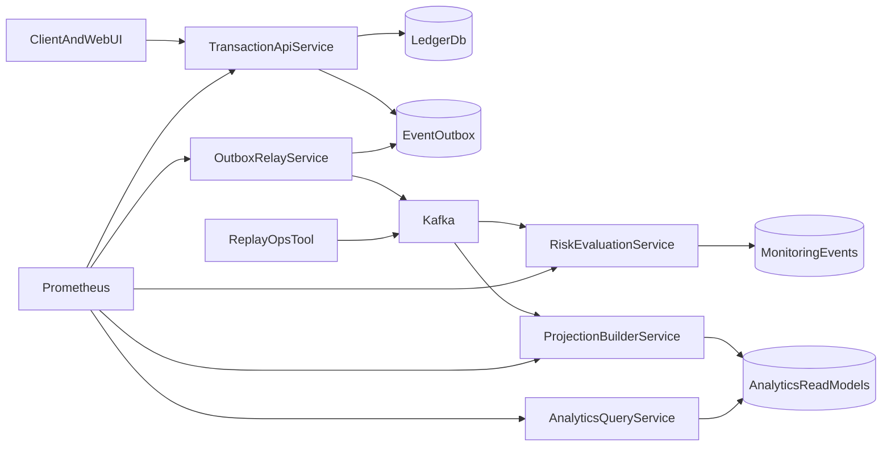

# Материалы для защиты микросервисной архитектуры

## Как позиционировать систему

Текущая реализация должна подаваться как учебная `микросервисно-ориентированная event-driven система потоковой обработки финансовых транзакций`.

Ключевые тезисы:

1. `transaction-api service` отвечает только за write-side: прием запросов, валидацию, auth, audit, idempotency и запись бизнес-данных.
2. `outbox-relay service` отделяет бизнес-транзакцию от публикации в Kafka и реализует асинхронную доставку событий.
3. `projection-builder service` независимо строит read-model и streaming projections из Kafka-событий.
4. `risk-evaluation service` независимо обрабатывает тот же поток и формирует risk / monitoring events.
5. `analytics-query service` отделяет read-path от write-path и отдает projection-based аналитику.
6. `dlqreplay` играет роль ops/admin контура для эксплуатационных сценариев.

## Что показать на слайде Архитектура

## Какие доказательства показать комиссии

- `docker compose ps` с сервисами `transaction-api`, `analytics-query`, `outbox-relay`, `projection-builder`, `risk-evaluation`.
- `http://localhost:8081/health`, `http://localhost:8082/health`, `http://localhost:8083/health`, `http://localhost:2112/health`, `http://localhost:2113/health`.
- Grafana / Prometheus Targets, где видно несколько application services.
- Создание транзакции через UI или `curl`, после чего показать:
  - запись в `transactions`;
  - запись в `event_outbox`;
  - публикацию события relay-сервисом;
  - обработку события двумя subscribers;
  - запись в `analytics_transactions`;
  - запись в `monitoring_events`;
  - чтение аналитики через analytics-query service.

## Что говорить про банковский стиль системы

- Используется `transactional outbox`, чтобы не терять события между БД и Kafka.
- Есть `Idempotency-Key` на write-side.
- Есть дедупликация событий по `(subscriber_name, event_id)` на processing-side.
- Есть `retry` и `DLQ` для проблемных сообщений.
- Есть audit log и метрики по каждому контуру.
- Есть разделение `write-side` и `read-side`, близкое к CQRS-подходу.
- Асинхронная обработка теперь разделена по ownership: projection и risk выделены в разные runtime-сервисы.

## Что говорить честно про ограничения

Это важно проговаривать самим, чтобы комиссия не поймала на несоответствии:

- PostgreSQL пока общий для нескольких сервисов.
- Kafka-кластер учебный: один broker, без production replication.
- Аутентификация demo-уровня, без отдельного IAM/Auth service.
- Нет schema registry, service mesh и полноценной distributed tracing.

## Последовательность живой демонстрации

1. Поднять стек `make compose-up`.
2. Показать health пяти сервисов.
3. Создать транзакцию через UI.
4. Показать, что API пишет бизнес-данные и outbox.
5. Показать, что relay публикует событие в Kafka.
6. Показать, что `projection-builder` формирует projection, а `risk-evaluation` независимо пишет monitoring event.
7. Показать запрос к `analytics-query service`.
8. Показать Grafana/Prometheus.
9. При необходимости кратко рассказать про replay и DLQ.
